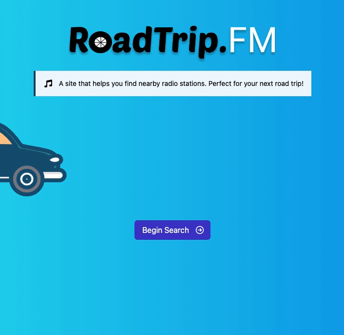

# RoadTrip.FM 🚗

<!-- PROJECT LOGO -->
<br />
<p align="center">
  <a href="https://github.com/Cool-Runningz/roadtrip-fm">
    
  </a>
  <p align="center">
  <strong> A site that helps you find nearby radio stations. Perfect for your next road trip!</strong>
    <br />
    <br />
    <a href="https://www.roadtripfm.live">View Demo 🏗️</a>
  </p>
</p>

[](https://app.netlify.com/sites/roadtrip-fm/deploys)

<!-- ABOUT THE PROJECT -->

## How it Works ✨

When you begin your search you will be prompted with two potential paths that you can take:

1. **Manual Search** - This option allows you to narrow down your location by manually selecting the city and state that the user is currently driving through.
2. **GPS Search** - This path leverages the browsers native [Geolocation API](https://developer.mozilla.org/en-US/docs/Web/API/Geolocation_API) in order to retrieve the user’s latitude & longitude. When the user’s coordinates have been identified, a map will be shown with a marker
   indicating their location.



## Built With 🛠️

- [Remix](https://remix.run/) (Full-stack web framework)
- [Tailwind CSS](https://tailwindcss.com/) (Utility-first CSS framework)
- [Heroicons](https://heroicons.com) (SVG icons)
- [Tailwind UI Kit](https://tailwindui.com) (UI components, crafted with Tailwind CSS)
- [Headless UI](https://headlessui.dev) (Unstyled, fully accessible UI components)
- [Prisma](https://www.prisma.io/) (ORM to help with database related work)
- [Countries States Cities Database](https://github.com/dr5hn/countries-states-cities-database) (Full Database of city, states, and countries available in SQL format.)
- [MySQL Database](https://www.mysql.com/) (Main data driver that makes this whole thing possible)
- [React Leaflet](https://react-leaflet.js.org/) (React wrapper around the [Leaflet.js](https://leafletjs.com/) library that provides a nice, visual map on the GPS search page)

## Installation & Configuration

💿 &nbsp; [Remix Docs](https://remix.run/docs)

### Netlify Setup

1. Install the [Netlify CLI](https://www.netlify.com/products/dev/):

```sh
npm i -g netlify-cli
```

If you have previously installed the Netlify CLI, you should update it to the latest version:

```sh
npm i -g netlify-cli@latest
```

2. Sign up and log in to Netlify:

```sh
netlify login
```

3. Create a new site:

```sh
netlify init
```

### Development

The Netlify CLI starts your app in development mode, rebuilding assets on file changes.

```sh
npm run dev
```

Open up [http://localhost:3000](http://localhost:3000), and you should be ready to go!

### Deployment

There are two ways to deploy your app to Netlify, you can either link your app to your git repo and have it auto deploy changes to Netlify, or you can deploy your app manually. If you've followed the setup instructions already, all you need to do is run this:

```sh
$ npm run build
# preview deployment
$ netlify deploy

# production deployment
$ netlify deploy --prod
```

## License

Distributed under the MIT License. See `LICENSE` for more information.

## Contact

Alyssa Holland - [@alyssa_codes](https://twitter.com/alyssa_codes) - HeyAHolland@gmail.com

Project Link: [https://github.com/Cool-Runningz/range-input.css](https://github.com/Cool-Runningz/range-input.css)
